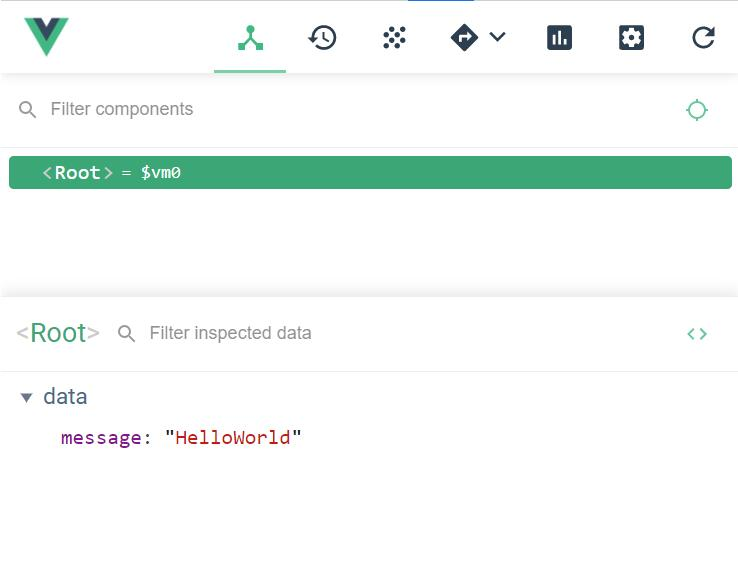

# HelloWorld

在这一章之后，我们将要正式开始使用Vue了。刚开始，我们只需要在HTML中引入Vue就可以开始学习使用了，关于Vue-cli我们将在后面的章节中进行讲解。

**注意：每一章所对应的源代码都存放在code文件夹中**

## 安装
Vue**分开发版本**和**生产版本**，开发版本包含了完整的警告和调试模式，生产版本删除了警告，体积更小，具有更快的加载速度。

现在，我们可以在HTML页面中通过`<script>`标签引入Vue
```html
<script src="../Vue.js"></script>
```

## 创建第一个Vue应用
首先，我们需要在HTML页面中为Vue指定一个容器，这个容器之后将被Vue管理。这里，我们将容器的id设为"root"(也可以是其他的)，方便后续被Vue实例“**锁定目标**”。
```html
<div id="root">
	<h1>{{message}}</h1>
</div>
```
容器中`<h1>`标签中双花括号及其内部最终会被Vue替换为指定数据，接下来我们创建一个Vue实例，并在其中设置数据。
```html
<script>
	let vm = new Vue({
		el: "#root",
		data: {
			message: "HelloWorld"
		}
	})
</script>
```
我们来逐行分下一下这段代码：

首先，我们使用`Vue()`构造函数生成了一个Vue实例，并使用vm变量进行接收。(使用vm进行接收的目的是方便在浏览器console中进行代码调试)

构造函数中需要传入一个对象，其中`el`表示元素(全称是element)，其值需要填入将要被Vue管理的容器的css选择器(String)；data表示数据，其值应当为一个对象，内部以key:value的形式存放数据。

如果这些都操作无误，刷新浏览器，可以看到页面中出现了`HelloWorld`字样。

经过上面这些操作，你应该已经理解了Vue视图与数据绑定的基本方式。

## 验证响应式
前面的章节提到过，Vue是响应式的，接下来将通过浏览器的console(控制台)进行实验。

你可以在console中输入如下指令来修改Vue中的数据：
```javascript
vm.message = "HaHaHa"
```
当你按下回车键的一瞬间，你会发现页面中的`HelloWorld`在一瞬间变为了`HaHaHa`。

关于响应式的原理，我们在后面的章节进行介绍。

## Vue开发者工具
Vue为了方便开发者进行调试，推出了一款开发者工具，可以清楚的观察Vue的数据存储结构，方便随时修改、观察数据变化。


开发者工具可以在Chrome应用商店下载到，但是在国内访问Chrome应用商店需要采用特殊的方法。